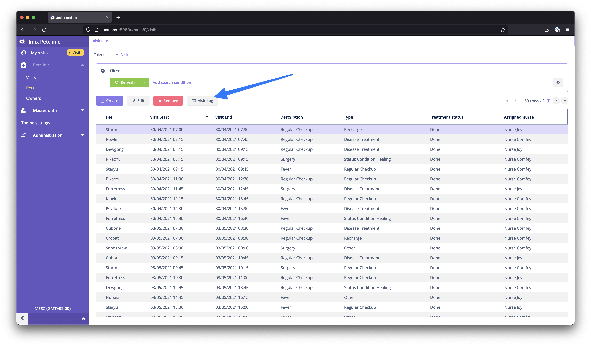
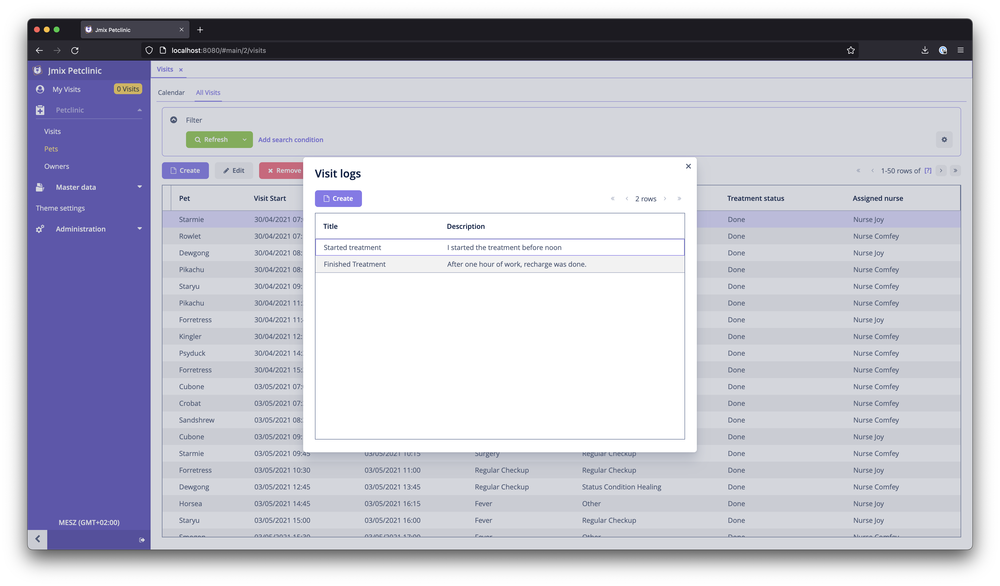
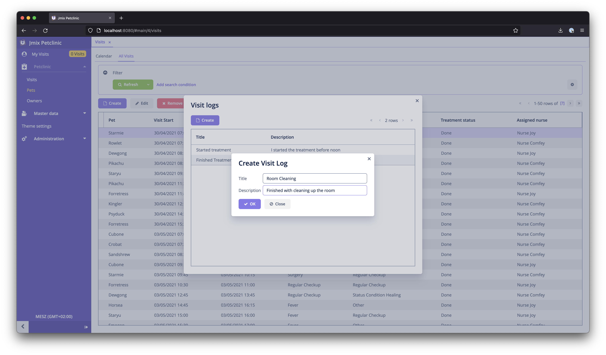

<p align="center">
  
</p>

## Jmix - DynamoDB Integration

This example application shows how to integrate a DynamoDB table into a Jmix application.

The example scenario is the following:

For Visits, it is possible to keep a log book of `VisitLog` entries. Those Log entries should be stored in DynamoDB.

### 1. Spring Data DynamoDB dependency

There is a [Spring Data DynamoDB](https://github.com/michaellavelle/spring-data-dynamodb) integration out there, which we can leverage to ease the actual interaction with DynamoDB.

Add the following dependency to your Jmix application:

````groovy
dependencies {
    // ...
    implementation 'com.github.derjust:spring-data-dynamodb:5.1.0'
}

````

### 2. DynamoDB Config

To define the DynamoDB beans that should be used, create a DynamoDBConfig class in your application like this:

```java

@Configuration
@EnableDynamoDBRepositories(basePackageClasses = VisitLogRepository.class)
public class DynamoDBConfig {


	@Primary
	@Bean
	public DynamoDBMapperConfig dynamoDBMapperConfig() {
		return DynamoDBMapperConfig.DEFAULT;
	}

	@Primary
	@Bean
	public DynamoDBMapper dynamoDBMapper(AmazonDynamoDB amazonDynamoDB, DynamoDBMapperConfig config) {
		return new DynamoDBMapper(amazonDynamoDB, config);
	}

	@Primary
	@Bean
	public AmazonDynamoDB amazonDynamoDB() {
		return AmazonDynamoDBClientBuilder.standard()
				.withRegion(Regions.US_EAST_1).build();
	}
}
```

### 3. VisitLog DTO entity

Now let's create a DTO entity for the Visit log. Use the annotation from dynamodb to indicate which table should be used
and which properties are considered to be the hash key:

````java

@DynamoDBTable(tableName = "visit-log")
@JmixEntity(name = "petclinic_VisitLog", annotatedPropertiesOnly = true)
public class VisitLog {

    @JmixProperty
    @JmixGeneratedValue
    @JmixId
    private UUID id;

    @JmixProperty(mandatory = true)
    @NotNull
    private UUID visitId;

    @JmixProperty
    private String title;

    @InstanceName
    @JmixProperty
    private String description;

    @DynamoDBAttribute
    public UUID getVisitId() {
        return visitId;
    }

    public void setVisitId(UUID visitId) {
        this.visitId = visitId;
    }

    @DynamoDBAttribute
    public String getTitle() {
        return title;
    }

    public void setTitle(String title) {
        this.title = title;
    }

    @DynamoDBAttribute
    public String getDescription() {
        return description;
    }

    public void setDescription(String description) {
        this.description = description;
    }

    @DynamoDBHashKey
    @DynamoDBAutoGeneratedKey
    public UUID getId() {
        return id;
    }

    public void setId(UUID id) {
        this.id = id;
    }
}
````

### 4. Create Spring Data Repository

Next up we can create our Spring Data repository in order to interact with the table. K
```java
import org.socialsignin.spring.data.dynamodb.repository.EnableScan;
import org.springframework.data.repository.CrudRepository;

@EnableScan
public interface VisitLogRepository extends CrudRepository<VisitLog, UUID> {

    List<VisitLog> findByVisitId(UUID visitId);
}
```

### 5. Use Repository in application Code

For easier integration additionall we can create a `VisitLogService`, that acts as the logic layer for interacting with the Table:


```java

@Component("petclinic_VisitLogService")
public class VisitLogService {

    @Autowired
    VisitLogRepository visitLogRepository;

    public List<VisitLog> findByVisit(Visit visit) {
        return visitLogRepository.findByVisitId(visit.getId());
    }

    public void saveLogEntry(VisitLog visitLog) {
        visitLogRepository.save(visitLog);
    }
}
```


### 6. Integrate with Jmix UI

#### Show Visit Log Entries





Now it is possible to use the new DTO entity in our application. It is possible to generate Screens for the DTO entity. 

In this example you will find the VisitLogBrowse and VisitLogEditor accordingly.

The browse screen loads the entites via the Service during initialization of the screen:

````java
public class VisitLogBrowse extends StandardLookup<VisitLog> {

    private Visit visit;
    @Autowired
    private CollectionContainer<VisitLog> visitLogsDc;
    @Autowired
    private VisitLogService visitLogService;
    @Autowired
    private Metadata metadata;

    @Subscribe
    public void onBeforeShow(BeforeShowEvent event) {
        visitLogsDc.setItems(
            visitLogService.findByVisit(visit)
        );
    }
}
````

The visit parameter is passed in by the VisitBrowse screen, where this screen is called from. The `setItems` method sets
the values into the data container and utilises the `VisitLogService` for loading the data.

#### Create Visit Log Entries




When creating the Visit Log Entries, we need change the way it is stored. For that we can use the commit delegate handler:

````java
@UiController("petclinic_VisitLog.edit")
@UiDescriptor("visit-log-edit.xml")
@EditedEntityContainer("visitLogDc")
public class VisitLogEdit extends StandardEditor<VisitLog> {

    @Autowired
    VisitLogService visitLogService;

    @Install(target = Target.DATA_CONTEXT)
    private Set<Object> commitDelegate(SaveContext saveContext) {
        visitLogService.saveLogEntry(getEditedEntity());
        return Set.of(getEditedEntity());
    }
}
````

The actual storage is done by the `VisitLogService` once again.


